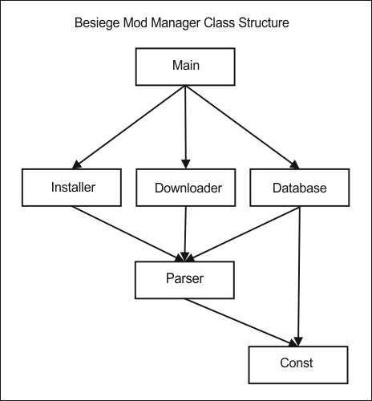

BESIEGE MOD MANAGER

Still in early development - version 0.2. Use for testing only.

INSTALLATION:
Make a backupf of your mods directory and delete the original (the loader can't figure out what is pre-installed there yet). 
Download [bmm0.2.exe](https://github.com/brada1/bmm/raw/master/source/dist/bmm0.2.exe) into your Besiege dir (where Besiege.exe is).

USAGE:
Run bmm0.2.exe through CMD and follow the instructions.

TO DO LIST:

- work closely with the modLoader.json file to allow enabling/disabling a mod instead of installing/uninstalling

- optimize database comparison algorithm

- fill in database

- add more special installation cases for mods such as the Water Mod

- the manager needs to have an online and offline state
	- in online state it can download and install/uninstall mods
	- in offline state it can only install/uninstall mods

- make a GUI

- build a standalone .exe

- inclide the option for updating to newer mod versions

- include custom .lvl management

TECHNICAL INFO:

[]

- Main():
	- asks the user for operations on downloading/removing and installing/uninstalling mods
	- calls the Database() class to show a list of mods
	- calls the Installer(), Downloader() if the user wishes to
- Database():
	- scans the downloads dir and creates a local database
		- this contains info about which mods are downloaded, their version and if they are installed or not
	- connects to the online database to get a list of all the availabe mods for download
		- also checks the newest version and where it should be downloaded locally
	- calls the Parser() and the Const() classes to get the required paths and urls
- Downloader():
	- downloads or removes the the downloaded zip of a mod
	- calls the Parser() class to get the necessary paths and urls 
- Installer():
	- installs or deinstalls a given mod
	- has a special case for Spaar's Mod Loader
	- calls the Parser() and the Const() classes to get the required paths and urls
- Parser():
	- does the heavy lifting of parsing paths and urls
- Const():
	- contains some constants and variables 

